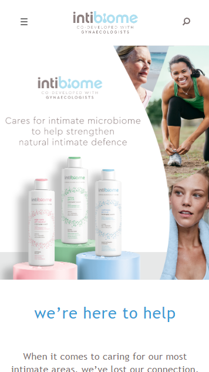
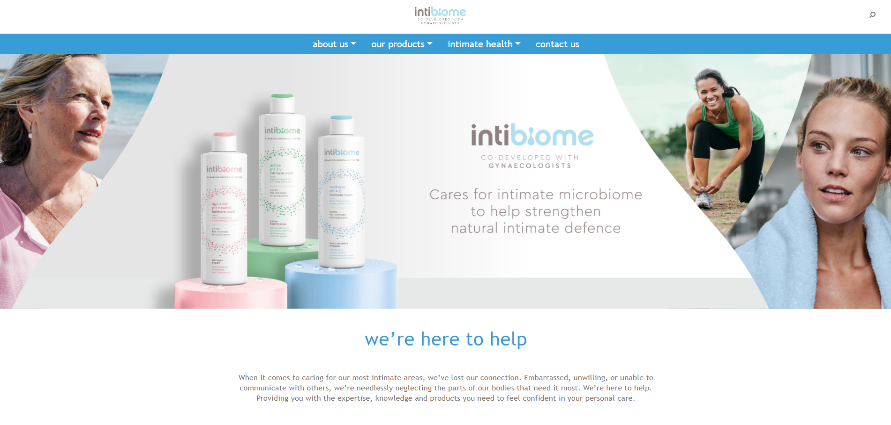

# Interbiome

This project was created for mobile and desktop style, developed with React and Bootstrap features.

## Steps to execute the project

- Clone the project
- Install npm (It can be used to install all dependencies of a project) 

   ### `npm install`
    
- Run project with npm

   ### `npm start`

Now you can see the desktop version and manipulate it to visualize mobile's version.

Hope you enjoy it!

  

  

